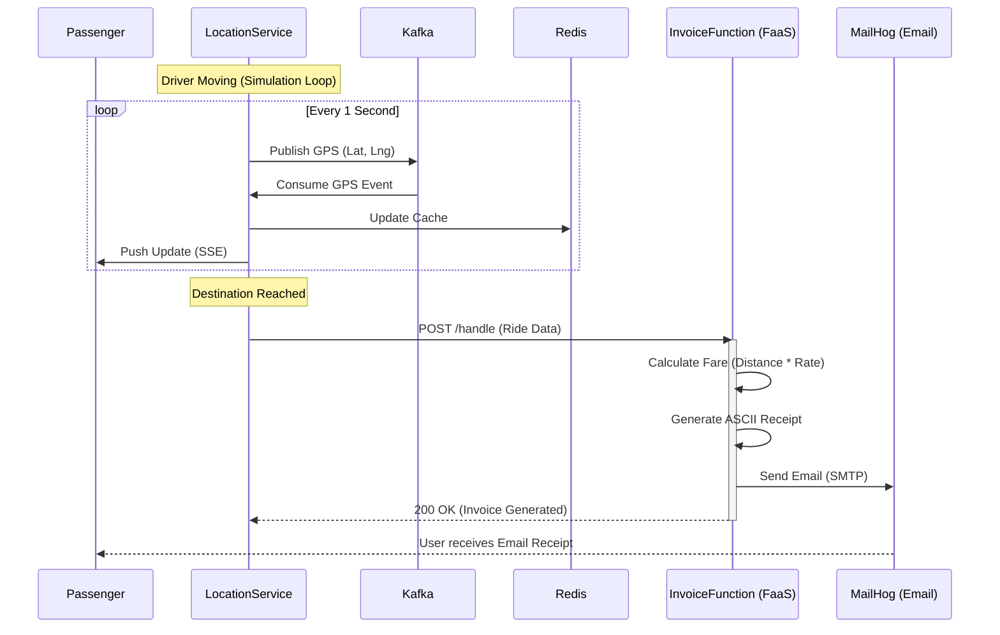

```mermaid
sequenceDiagram
    participant P as Passenger
    participant L as LocationService
    participant K as Kafka
    participant R as Redis
    participant F as InvoiceFunction (FaaS)
    participant M as MailHog (Email)

    Note over L: Driver Moving (Simulation Loop)
    
    loop Every 1 Second
        L->>K: Publish GPS (Lat, Lng)
        K->>L: Consume GPS Event
        L->>R: Update Cache
        L->>P: Push Update (SSE)
    end

    Note over L: Destination Reached

    L->>F: POST /handle (Ride Data)
    activate F
    F->>F: Calculate Fare (Distance * Rate)
    F->>F: Generate ASCII Receipt
    F->>M: Send Email (SMTP)
    F-->>L: 200 OK (Invoice Generated)
    deactivate F

    M-->>P: User receives Email Receipt
```